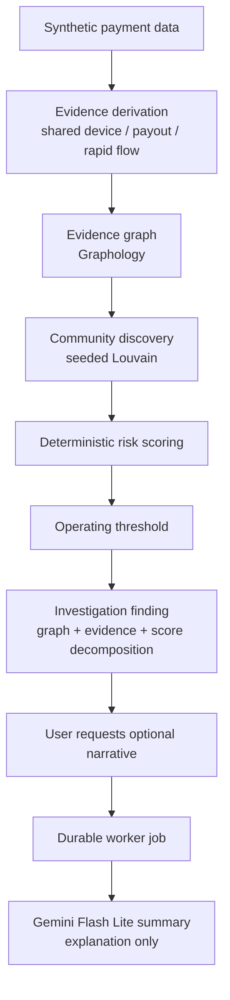

# Nexus


Explainable fraud-network detection for payment systems.

Built for Razorpay AI Buildathon 2026 · Track 02 — AI Risk Manager.

Fraud rings are difficult to detect when transactions are examined in isolation. Nexus derives relationships from payment activity, builds an evidence graph, discovers suspicious communities, deterministically scores them, and exposes the evidence to investigators.

Gemini is explanation-only. It cannot change risk scores, ranking, thresholds, findings, or evaluation metrics.

## Reference benchmark

On the independently seeded synthetic held-out dataset `nexus-heldout-hard-v5-2026-09-02`, the frozen detector recovered 35/35 planted rings (100% ring recall), 100% of planted entities, and achieved 87.5% community precision with 5 genuine hard-negative false positives. Modeled review cost was ₹1,250 with ₹0 missed exposure at threshold 45.

These measurements apply only to reproducible synthetic held-out patterns and do not establish real-world fraud performance. See [the release report](docs/release-report.md).

## How it works



Evaluation path: tuning synthetic dataset → select detector profile → LOCK PROFILE → independently seeded held-out dataset → precision / recall / false-positive review cost.

## Architecture

- `apps/web`: private Next.js gate, APIs, and investigator dashboard.
- `apps/worker`: durable jobs and the tuning/held-out pipeline.
- `packages/synthetic`: deterministic payment and hard-negative generation.
- `packages/detection`: evidence, graph, Louvain, scoring, and evaluation.
- `packages/db`: schema, migrations, and persistence.
- `packages/core`: shared contracts, policy, and money utilities.
- `config/nexus.policy.json`: versioned frozen policy.

## Running locally

Prerequisites: Node.js 24, Bun 1.4, Docker, and PostgreSQL. Copy `.env.example` to `.env`. For Bun development, keep the raw Argon2id hash in the gitignored `apps/web/.secrets/access-password.hash` and set `NEXUS_ACCESS_PASSWORD_HASH_FILE=.secrets/access-password.hash` in `apps/web/.env.development.local`.

```sh
bun install --frozen-lockfile
bun run db:migrate
bun run data:seed
bun run pipeline:run
bun run dev
```

Run `bun run dev:worker` in a second terminal.

Gemini narratives are generated on demand for flagged findings. The finding page shows the deterministic explanation immediately; selecting **Generate AI summary** queues a durable worker job, displays a generating state, and caches a successful response. The worker must be running for this action.

The release gate is:

```sh
bun run format:check
bun run lint
bun run typecheck
bun run test
bun run build
bun run test:e2e
```

See [methodology](docs/methodology.md), [operations](docs/operations.md), and [limitations](docs/limitations.md) for reproducibility and non-goals.

## Security and limitations

The password gate, strict origin checks, secure session cookie, and rate limits protect this controlled demonstration. Production authentication remains environment-driven. Nexus is batch-oriented synthetic evaluation software, not a payment authorizer, case-management system, compliance certification, or claim of real-world fraud accuracy.
